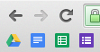

Create single-click shortcuts to create new documents and spreadsheets in Google Drive!

The blue icon opens a fresh Google Doc, and the green one opens a fresh Google Sheet.

### How to use

1. Clone this repo (or just download a .zip).
2. Put it somewhere permanent (just don't delete it later, or it'll stop working).
4. In Chrome, ensure your Bookmarks bar is showing (Cmd + Shift + B).
3. Open the folder (in Finder).
4. Drag the `docs.html` file to your Bookmarks bar.
5. Drag the `sheets.html` file to your Bookmarks bar.
6. For each new bookmark: Right-click on it, then click edit, then delete the "Name" field.
7. Enjoy!
